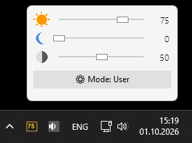

# Eyedim

Lightweight Windows utility to control display **brightness**, **night light** and **contrast** directly from the system tray.



## Features

- Brightness control for all monitors (DDC/CI + WMI)
- Night light (warm color temperature)
- Contrast adjustment via gamma ramp
- System tray icon showing current brightness
- "User" and "Default" preset modes
- Autostart with Windows
- English / Russian interface

## Requirements

- Windows 10 / 11
- Python 3.13+ (tested). Earlier versions may work but are not officially supported.

## Installation

Install dependencies:

```bash
pip install -r requirements.txt